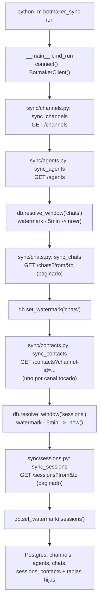

# botmaker_sync

Extrae chats, sesiones (conversaciones), agentes, canales y contactos de la
[API de Botmaker](https://api.botmaker.com/v2.0) (solo GET) hacia Postgres.

## Configuración

```bash
python3 -m venv venv
source venv/bin/activate
pip install -r requirements.txt
cp .env.example .env   # completá BOTMAKER_ACCESS_TOKEN y DATABASE_URL
python -m botmaker_sync init-db
```

El `BOTMAKER_ACCESS_TOKEN` se genera en la
[página de integraciones de Botmaker](https://go.botmaker.com/#/integrations/api).

### Dónde vive Postgres (local, IP o dominio)

`DATABASE_URL` es la única configuración del destino, y el host puede ser
`localhost`, una IP o un dominio indistintamente -- no hace falta tocar
código para apuntar a producción. Para cualquier host que no sea
`localhost`, agregá `?sslmode=require` (o `verify-full` si tenés el
certificado de la CA) al final de la URL: sin eso, la conexión usa
`sslmode=prefer` por defecto, que cae a una conexión **sin cifrar** en
silencio si el servidor no ofrece TLS. Ver ejemplos en `.env.example`.

La conexión reintenta 3 veces ante fallas transitorias (timeout de 5s por
intento) antes de fallar -- pensado para un host de verdad en la red, no solo
un socket local.

## Uso

```bash
# Sync incremental: continúa desde el último watermark (la primera corrida no
# tiene límite inferior y usa la ventana por defecto de la API).
python -m botmaker_sync run

# Rango manual (NO avanza el watermark):
python -m botmaker_sync run --since 2026-01-01T00:00:00 --until 2026-01-02T00:00:00

# Solo algunas entidades:
python -m botmaker_sync run --entities channels,agents

# Incluir análisis de IA de la conversación / sesiones todavía abiertas:
python -m botmaker_sync run --include-ai-analysis --include-open-sessions
```

Corré el comando de nuevo cada vez que quieras datos nuevos -- con un
cron/Task Scheduler si querés que sea automático:

```cron
0 * * * * cd /path/to/botmaker && venv/bin/python -m botmaker_sync run >> sync.log 2>&1
```

### `--entities` y `--since`/`--until`: cómo funcionan

- **`--entities`**: lista separada por comas, subconjunto de
  `channels,agents,chats,sessions`. Filtra qué bloques de `cmd_run` corren.
  `contacts` no es un entity propio -- se sincroniza automáticamente como
  parte de `chats` (`__main__.py` llama `sync_contacts` inmediatamente
  después de `sync_chats`, con el set de chats tocados en esa misma
  corrida), así que para traer contactos hace falta incluir `chats`.
- **`--since`/`--until`**: si pasás cualquiera de los dos, `resolve_window()`
  devuelve ese valor tal cual (sin tocar el watermark guardado) en vez de
  calcular `watermark - 5min`. Tampoco se llama `set_watermark()` después
  (`manual_range=True` en `cmd_run`), así que el cursor incremental normal
  queda intacto -- podés reprocesar un rango pasado sin desincronizar las
  próximas corridas automáticas.
- **Omitir `--since` y pasar solo `--until`** replica exactamente el
  comportamiento de la primera corrida (sin límite inferior, deja que la API
  aplique su ventana reciente por defecto) pero fijando el límite superior.
  Ejemplo real: después de una corrida cuyo `sync_contacts` falló por
  timeout, el watermark de `chats` ya había quedado en
  `2026-06-24T16:51:24Z`. Para reconstruir el set de chats tocados y
  reintentar `contacts` sobre esos mismos 639 chats sin perder ni duplicar
  nada, se repitió la misma ventana:

  ```bash
  python -m botmaker_sync run --entities chats --until 2026-06-24T16:51:24Z
  ```

  `chats` se vuelve a upsertear (es idempotente, `ON CONFLICT DO UPDATE`),
  se reconstruye `touched` en memoria y `contacts` se reintenta para esos
  chats -- sin avanzar el watermark, porque `--until` activó el modo manual.
  Importante: pasar un `--since` muy lejano (ej. `2000-01-01`) en vez de
  omitirlo tira `400 INVALID_DATETIME_INTERVAL` -- la API de Botmaker no
  acepta un rango `from`/`to` mayor a 1 mes sin `long-term-search=true` (ver
  [Limitaciones conocidas](#limitaciones-conocidas)).

## Qué se sincroniza, y cómo

| Entidad | Endpoint | Alcance |
|---|---|---|
| channels | `GET /channels` | refresh completo en cada corrida (sin filtro de tiempo) |
| agents | `GET /agents` | refresh completo en cada corrida (sin filtro de tiempo) |
| chats | `GET /chats` | incremental, `from`/`to` por última actividad |
| sessions | `GET /sessions` | incremental, `from`/`to` por inicio de sesión, incluye mensajes/variables/eventos |
| contacts | `GET /contacts?channel-id=...` | **acotado**: solo contactos referenciados por los chats de esta corrida |

Las entidades incrementales (`chats`, `sessions`) guardan un watermark por
entidad en `sync_state`. El `to` de cada corrida se vuelve el `from` de la
siguiente, menos un solapamiento de 5 minutos para que el upsert absorba
duplicados de borde. Pasar `--since` y/o `--until` explícitamente cambia a un
rango manual puntual y no toca el watermark.

## Flujo de ejecución

Cada archivo le corresponde un endpoint y una responsabilidad puntual.
`__main__.py` orquesta el orden; `client.py` es el único que habla HTTP;
`db.py` es el único que habla SQL; `models.py` es el único que conoce la
forma de las respuestas de Botmaker.



Por archivo:

- **`client.py`** (`BotmakerClient`) -- único punto que hace requests HTTP.
  `get_pages()` resuelve la paginación (sigue `nextPage`, que según el
  endpoint llega como URL absoluta o como token opaco) y `_get()` reintenta
  con backoff exponencial ante 429/5xx/timeouts. Cada `sync_*` itera
  `client.get_pages(...)`, página por página.
- **`models.py`** -- un `pydantic.BaseModel` por shape de respuesta
  (`ChatModel`, `SessionModel`, `ContactModel`, ...), mapeando los alias de
  la API (`camelCase`) a campos `snake_case`. `extra="ignore"` para que un
  campo nuevo de Botmaker no rompa el parseo.
- **`db.py`** -- único punto que habla SQL: `connect()` (con retry),
  `resolve_window()`/`set_watermark()` (watermark incremental),
  `upsert_rows()` (`INSERT ... ON CONFLICT DO UPDATE`) y
  `replace_children()` (`DELETE` + `INSERT` para listas hijas: tags,
  variables, teléfonos, mensajes, etc.).
- **`sync/channels.py` / `sync/agents.py`** -- los más simples: una página
  tras otra de `GET /channels` o `GET /agents`, upsert directo, sin filtro de
  tiempo ni estado.
- **`sync/chats.py`** -- pagina `GET /chats?from=...&to=...`, hace upsert de
  cada chat y de sus tablas hijas (`chat_tags`, `chat_variables`), y devuelve
  el set `{(channel_id, contact_id), ...}` de todo lo tocado en la corrida
  (`contact_id` acá es el id de plataforma, ej. el número de teléfono).
- **`sync/contacts.py`** -- no existe `GET /contacts/{id}`, así que recibe
  ese set de `sync_chats` y, agrupado por canal, pagina
  `GET /contacts?channel-id=...` buscando esos ids dentro de
  `chats[].platformContactId` de cada contacto (no en `item.id`, que es el id
  interno de Botmaker). Para de paginar un canal en cuanto encuentra todos
  los que buscaba en ese canal.
- **`sync/sessions.py`** -- igual a `chats.py` pero contra
  `GET /sessions?from=...&to=...`, con sub-listas de mensajes/eventos/análisis
  de IA (`replace_children` para cada una).

## Limitaciones conocidas

- **Sin `long-term-search`**: ese flag suma costo facturado por BI del lado
  de Botmaker, así que nunca se envía. Sin él, `/chats` y `/sessions` solo
  devuelven datos dentro de su ventana reciente por defecto (aproximadamente
  el último día), sin importar qué tan atrás se ponga `from`. Hay que correr
  el sync con la frecuencia suficiente para que ningún hueco supere esa
  ventana, o aceptar huecos si se salta un período.
- **Alcance de contacts**: no existe un endpoint `/contacts/{id}`, así que
  "solo contactos nuevos" se implementa así: se junta cada par
  `(channel_id, contact_id)` visto en los chats de esta corrida, y luego se
  pagina `/contacts?channel-id=...` por canal, quedándose solo con los ids
  que coinciden. Si un contacto buscado nunca aparece en el listado de su
  canal, ese canal se escanea por completo una vez.
- El esquema se aplica con un `schema.sql` plano (`CREATE TABLE IF NOT
  EXISTS`), no con una herramienta de migraciones -- alcanza para el tamaño
  de este proyecto; volvé a correr `init-db` cada vez que cambie el esquema.

## Tests

```bash
pytest tests/ -v
```

Cubre la paginación (`nextPage` con URL y con token opaco), el retry ante
429, las funciones de mapeo de filas, y la lógica de la ventana de
watermark -- todo sin necesitar un Postgres real. Los caminos de
lectura/escritura a la base en sí se ejercitan corriendo `init-db` + `run`
contra una base de datos real.
